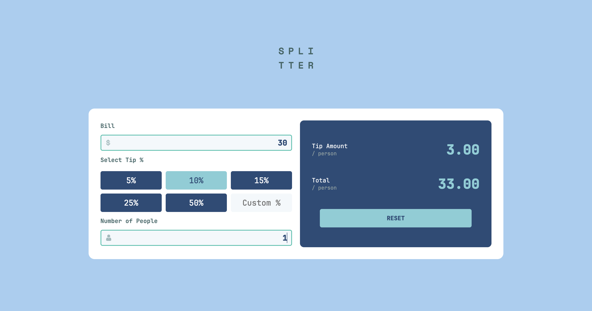

   
      
   

<h3 align="center">Bill Splitter</h3>

# Welcome to my app

This is a small webApp I created to practice my JavaScript skills and also avoid
those awkward moment of not knowing how much to tip when going out with friends. 

I want to also focus on using GRID css structure on this app instead of Flexbox
which I have been getting use to for the past few days.

### What I learned
- Do not add the background color to *{}, add it to body{} instead
- When you want to center a div, you want to change the property of its parent
- Input element properties and how to manipulate the content inside it
- Browsers stores your color and converts it to RGB
- You can use the class names from your css to manipulate them using classList
- When using querySelectorAll you are expecting a NodeList so you need a
  iteration that would go through them, for example forEach()

ISSUE: 
- I forgot to use input as an element and instead used div
- Custom input is not working

TODO: 
- [x] Focus on creating the html and css structure
- [x] JavaScript implementation
- [x] UI active state
- [x] Add the border color change in JS
- [x] Mobile version 
- [x] Add custom tip to your total functionality
- [x] Number of people needs to be added for total functionality as well
